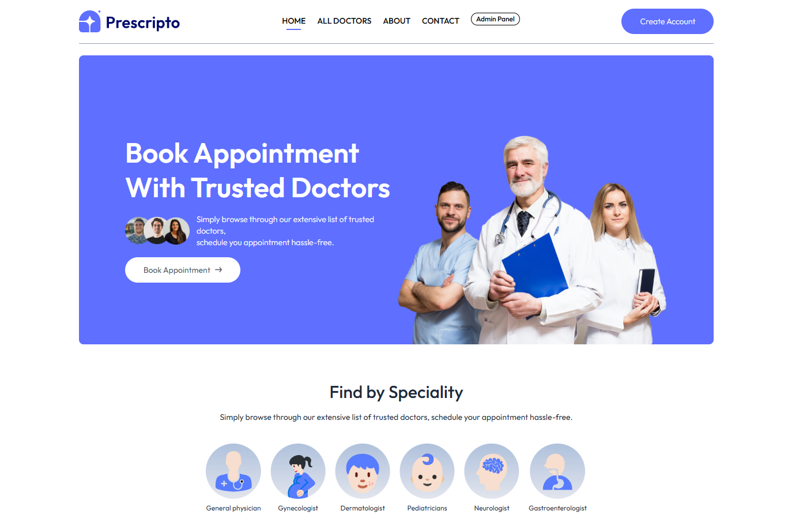

<!-- PROJECT LOGO -->
 

  

  <h3 align="center">Propr-Health</h3>

  

    A full-stack MERN application designed to streamline doctor appointments with seamless payment integration via Stripe.
     
    <a href="https://github.com/8bit-shawty/propr-health"><strong>Explore the docs »</strong></a>
     
     
    <a href="https://propr-health.vercel.app/">View Demo</a>
    &middot;
    &middot;
    <a href="https://github.com/your-username/propr-health/issues/new?labels=enhancement&template=feature-request---.md">Request Feature</a>
  

---

<!-- ABOUT THE PROJECT -->
## About The Project

[![Propr Health Screen Shot][product-screenshot]](https://example.com)

Propr-Health is a modern healthcare appointment booking system built using the MERN stack (MongoDB, Express, React, Node.js). It offers secure user authentication, easy appointment scheduling, and smooth payment processing via Stripe. 

### Key Features:
- User authentication & authorization
- Appointment scheduling system
- Payment processing with Stripe (USD)
- Secure backend with JWT authentication
- Responsive and user-friendly UI
- Deployment support for Vercel(frontend) and Render(backend)

(<a href="#readme-top">back to top</a>)

### Built With

This project is built with the following technologies:

#### **Frontend**
* 
* 
* 
* 
* 

#### **Backend**
* 
* 
* 
* 
* 
* 
* 
* 
* 
* 

#### **Payments & Deployment**
* 
* 
* 

(<a href="#readme-top">back to top</a>)

## 🏥 Client-Side Routes

The frontend of Propr-Health uses React Router for seamless navigation. Below is a breakdown of the available routes:

| Route                   | Description |
|-------------------------|-------------|
| `/`                     | Home page displaying an overview of the application. |
| `/doctors`              | Page listing all available doctors. |
| `/doctors/:speciality`  | Filtered list of doctors based on their specialty. |
| `/login`                | User authentication page (login/signup). |
| `/about`                | Information about the Propr-Health platform. |
| `/contact`              | Contact page to reach out for support or inquiries. |
| `/my-profile`           | User's personal profile and account settings. |
| `/my-appointments`      | List of scheduled appointments for the logged-in user. |
| `/appointment/:docId`   | Booking page for scheduling an appointment with a specific doctor. |

### 🛠️ **Navigation Components**
- `Navbar.jsx` - Persistent navigation bar displayed across all pages.
- `Footer.jsx` - Footer section for additional links and information.
- `ToastContainer` - Provides real-time notifications and alerts.

## 🔑 Admin & Doctor Panel Routes

The Propr-Health platform provides a dedicated panel for both **Admins** and **Doctors** to manage appointments, doctors, and patient interactions.

### 📌 **Admin Routes**
| Route                  | Description |
|------------------------|-------------|
| `/admin-dashboard`     | Overview of the admin panel, displaying key statistics. |
| `/all-appointments`    | View and manage all appointments across the platform. |
| `/add-doctor`         | Form to register a new doctor in the system. |
| `/doctor-list`        | View and manage a list of registered doctors. |

### 📌 **Doctor Routes**
| Route                   | Description |
|-------------------------|-------------|
| `/doctor-dashboard`     | Doctor's dashboard showing an overview of their activity. |
| `/doctor-appointments`  | List of appointments scheduled with the doctor. |
| `/doctor-profile`       | Page to manage the doctor's personal and professional details. |

### 🛠 **Navigation Components**
- `Navbar.jsx` - Persistent navigation bar for authenticated users.
- `Sidebar.jsx` - Sidebar for quick access to admin and doctor functionalities.
- `ToastContainer` - Provides real-time notifications and alerts.
- `Login.jsx` - Authentication page for both admins and doctors.

## Backend API Routes

### User Routes  
`POST /api/users/register`  
Registers a new user  

`POST /api/users/login`  
Authenticates and logs in a user  

`GET /api/users/get-profile`  
Fetches the user's profile (requires authentication)  

`POST /api/users/update-profile`  
Updates user profile (requires authentication)  

`POST /api/users/book-appointment`  
Books an appointment with a doctor (requires authentication)  

`GET /api/users/appointments`  
Retrieves a list of user appointments (requires authentication)  

`POST /api/users/cancel-appointment`  
Cancels an appointment (requires authentication)  

`POST /api/users/payment-razorpay`  
Initiates payment via Razorpay (requires authentication)  

`POST /api/users/verify-razorpay`  
Verifies a Razorpay payment  

`POST /api/users/payment-stripe`  
*Currently commented out* - Initiates payment via Stripe (requires authentication)  

`POST /api/users/verify-stripe-payment`  
*Currently commented out* - Verifies a Stripe payment  

---

### Admin Routes  
`POST /api/admin/add-doctor`  
Adds a new doctor (requires authentication, image upload supported)  

`POST /api/admin/login`  
Authenticates an admin user  

`POST /api/admin/all-doctors`  
Fetches a list of all registered doctors (requires authentication)  

`POST /api/admin/change-availability`  
Changes a doctor's availability status (requires authentication)  

`GET /api/admin/appointments`  
Fetches all appointments for admin review (requires authentication)  

`POST /api/admin/cancel-appointment`  
Cancels an appointment (requires authentication)  

`GET /api/admin/dashboard`  
Fetches admin dashboard statistics (requires authentication)  

---

### Doctor Routes  
`GET /api/doctors/list`  
Fetches a list of all available doctors  

`POST /api/doctors/login`  
Authenticates a doctor  

`GET /api/doctors/appointments`  
Fetches a list of doctor’s appointments (requires authentication)  

`POST /api/doctors/complete-appointment`  
Marks an appointment as completed (requires authentication)  

`POST /api/doctors/cancel-appointment`  
Cancels an appointment (requires authentication)  

`GET /api/doctors/dashboard`  
Fetches the doctor’s dashboard stats (requires authentication)  

`GET /api/doctors/profile`  
Fetches the doctor’s profile (requires authentication)  

`POST /api/doctors/update-profile`  
Updates doctor’s profile (requires authentication)  

